# NIO理论
## NIO基础
### 内存分布
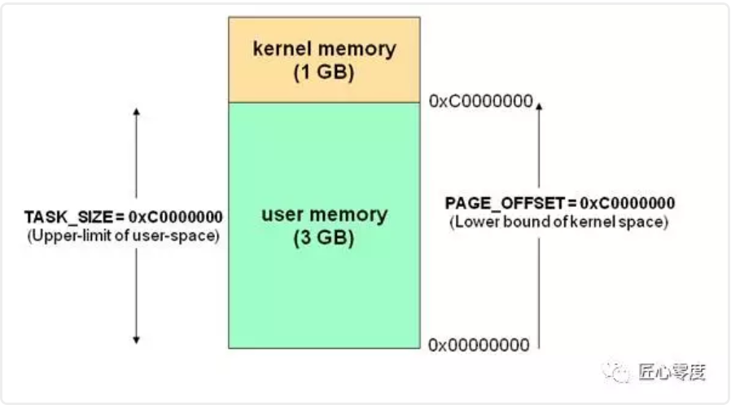
### Linux网络I/O模型
为了OS的安全性等的考虑，进程是无法直接操作I/O设备的，其必须通过系统调用请求内核来协助完成I/O动作，而内核会为每个I/O设备维护一个buffer。

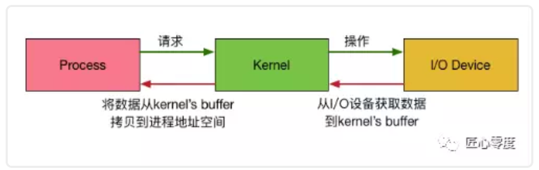

整个请求过程为： 用户进程发起请求，内核接受到请求后，从I/O设备中获取数据到buffer中，再将buffer中的数据copy到用户进程的地址空间，该用户进程获取到数据后再响应客户端。在整个请求过程中，数据输入至buffer需要时间，而从buffer复制数据至进程也需要时间。因此根据在这两段时间内等待方式的不同，I/O动作可以分为以下五种模式：

- 阻塞I/O (Blocking I/O)
- 非阻塞I/O (Non-Blocking I/O)
- I/O复用（I/O Multiplexing)
- 信号驱动的I/O (Signal Driven I/O)
- 异步I/O (Asynchrnous I/O) 说明：如果像了解更多可能需要linux/unix方面的知识了，可自行去学习一些网络编程原理应该有详细说明，不过对大多数java程序员来说，不需要了解底层细节，知道个概念就行，知道对于系统而言，底层是支持的。


**数据读取分两阶段：**
1. 等待数据准备
2. 将数据从内核拷贝到用户进程

### 阻塞I/O
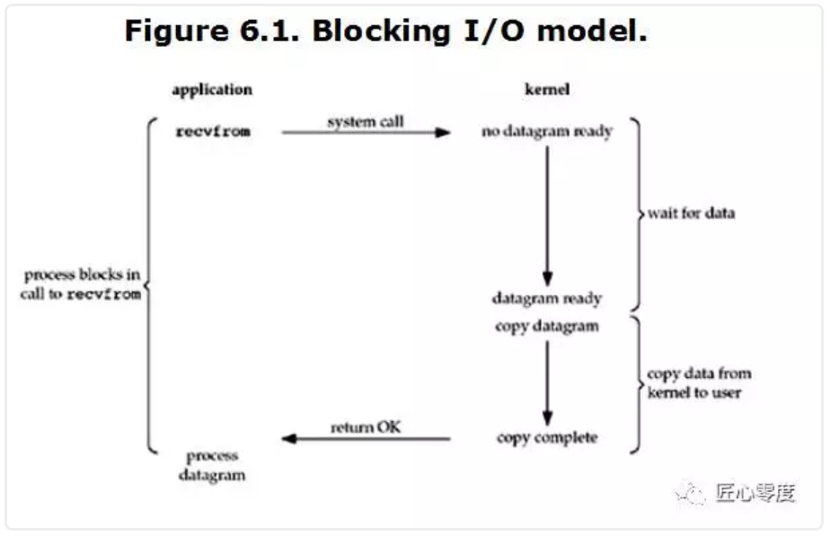
当用户进程调用了recvfrom这个系统调用，内核就开始了IO的第一个阶段：等待数据准备。对于network io来说，很多时候数据在一开始还没有到达（比如，还没有收到一个完整的UDP包），这个时候内核就要等待足够的数据到来。而在用户进程这边，整个进程会被阻塞。当内核一直等到数据准备好了，它就会将数据从内核中拷贝到用户内存，然后内核返回结果，用户进程才解除block的状态，重新运行起来。
**所以，blocking IO的特点就是在IO执行的两个阶段都被block了。**

### 非阻塞I/O

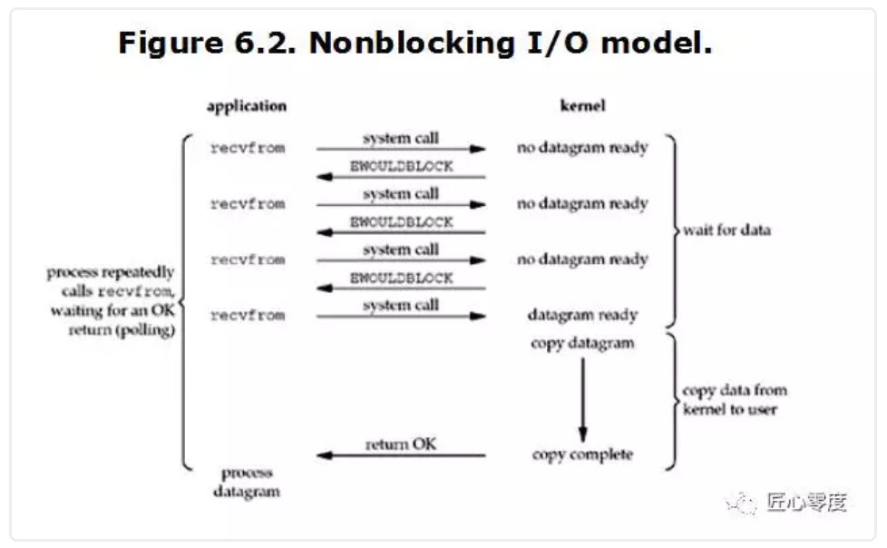
当用户进程调用recvfrom时，系统不会阻塞用户进程，而是立刻返回一个ewouldblock错误，从用户进程角度讲 ，并不需要等待，而是马上就得到了一个结果。用户进程判断标志是ewouldblock时，就知道数据还没准备好，于是它就可以去做其他的事了，于是它可以再次发送recvfrom，一旦内核中的数据准备好了。并且又再次收到了用户进程的system call，那么它马上就将数据拷贝到了用户内存，然后返回。

当一个应用程序在一个循环里对一个非阻塞调用recvfrom，我们称为轮询。应用程序不断轮询内核，看看是否已经准备好了某些操作。这通常是浪费CPU时间，但这种模式偶尔会遇到。
**数据准备阶段不阻塞，数据拷贝阶段阻塞**

### I/O复用
event driven IO
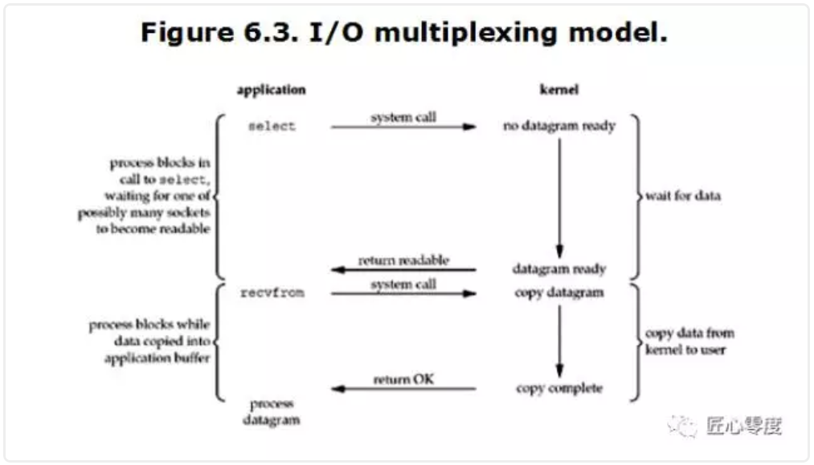
当用户进程调用了select，那么整个进程会被block，而同时，内核会“监视”所有select负责的socket，当任何一个socket中的数据准备好了，select就会返回。这个时候用户进程再调用read操作，将数据从内核拷贝到用户进程。 

这个图和blocking IO的图其实并没有太大的不同，事实上，还更差一些。因为这里需要使用两个system call (select 和 recvfrom)，而blocking IO只调用了一个system call (recvfrom)。但是，用select的优势在于它可以同时处理多个connection。（多说一句。所以，如果处理的连接数不是很高的话，使用select/epoll的web server不一定比使用multi-threading + blocking IO的web server性能更好，可能延迟还更大。select/epoll的优势并不是对于单个连接能处理得更快，而是在于能处理更多的连接。） 

**在IO multiplexing Model中，实际中，对于每一个socket，一般都设置成为non-blocking，但是，如上图所示，整个用户的process其实是一直被block的。只不过process是被select这个函数block，而不是被socket IO给block。**

**文件描述符**

Linux的内核将所有外部设备都可以看做一个文件来操作。那么我们对与外部设备的操作都可以看做对文件进行操作。我们对一个文件的读写，都通过调用内核提供的系统调用；内核给我们返回一个filede scriptor（fd,文件描述符）。而对一个socket的读写也会有相应的描述符，称为socketfd(socket描述符）。描述符就是一个数字，指向内核中一个结构体（文件路径，数据区，等一些属性）。那么我们的应用程序对文件的读写就通过对描述符的读写完成。

**select**

基本原理：select 函数监视的文件描述符分3类，分别是writefds、readfds、和exceptfds。调用后select函数会阻塞，直到有描述符就绪（有数据 可读、可写、或者有except），或者超时（timeout指定等待时间，如果立即返回设为null即可），函数返回。当select函数返回后，可以通过遍历fdset，来找到就绪的描述符。


缺点: 
1. select最大的缺陷就是单个进程所打开的FD是有一定限制的，它由FDSETSIZE设置，32位机默认是1024个，64位机默认是2048。 一般来说这个数目和系统内存关系很大，”具体数目可以cat /proc/sys/fs/file-max察看”。32位机默认是1024个。64位机默认是2048. 
2. 对socket进行扫描时是线性扫描，即采用轮询的方法，效率较低。 当套接字比较多的时候，每次select()都要通过遍历FDSETSIZE个Socket来完成调度，不管哪个Socket是活跃的，都遍历一遍。这会浪费很多CPU时间。如果能给套接字注册某个回调函数，当他们活跃时，自动完成相关操作，那就避免了轮询这正是epoll与kqueue做的。 

3. 需要维护一个用来存放大量fd的数据结构，这样会使得用户空间和内核空间在传递该结构时复制开销大。

**poll**

**基本原理** poll本质上和select没有区别，它将用户传入的数组拷贝到内核空间，然后查询每个fd对应的设备状态，如果设备就绪则在设备等待队列中加入一项并继续遍历，如果遍历完所有fd后没有发现就绪设备，则挂起当前进程，直到设备就绪或者主动超时，被唤醒后它又要再次遍历fd。这个过程经历了多次无谓的遍历。

它没有最大连接数的限制，原因是它是基于链表来存储的，但是同样有一个缺点：
1. 大量的fd的数组被整体复制于用户态和内核地址空间之间，而不管这样的复制是不是有意义。 
2. poll还有一个特点是“**水平触发**”，如果报告了fd后，没有被处理，那么下次poll时会再次报告该fd。

**注意：从上面看，select和poll都需要在返回后，通过遍历文件描述符来获取已经就绪的socket。事实上，同时连接的大量客户端在一时刻可能只有很少的处于就绪状态，因此随着监视的描述符数量的增长，其效率也会线性下降。**

**epoll**

epoll是在2.6内核中提出的，是之前的select和poll的增强版本。相对于select和poll来说，epoll更加灵活，没有描述符限制。epoll使用一个文件描述符管理多个描述符，将用户关系的文件描述符的事件存放到内核的一个事件表中，这样在用户空间和内核空间的copy只需一次。

**基本原理** epoll支持水平触发和边缘触发，最大的特点在于边缘触发，它只告诉进程哪些fd刚刚变为就绪态，并且只会通知一次。还有一个特点是，epoll使用“事件”的就绪通知方式，通过epollctl注册fd，一旦该fd就绪，内核就会采用类似callback的回调机制来激活该fd，epollwait便可以收到通知。

**epoll的优点** 
1. 没有最大并发连接的限制，能打开的FD的上限远大于1024（1G的内存上能监听约10万个端口）。 
2. 效率提升，不是轮询的方式，不会随着FD数目的增加效率下降。 只有活跃可用的FD才会调用callback函数；即Epoll最大的优点就在于它只管你“活跃”的连接，而跟连接总数无关，因此在实际的网络环境中，Epoll的效率就会远远高于select和poll。 
3. 内存拷贝，利用mmap()文件映射内存加速与内核空间的消息传递；即epoll使用mmap减少复制开销。

### 信号驱动的I/O
由于signal driven IO在实际中并不常用，所以简单提下。
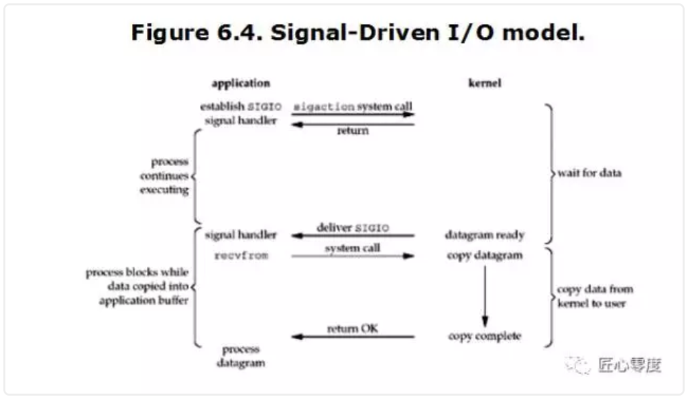
很明显可以看出用户进程不是阻塞的。首先用户进程建立SIGIO信号处理程序，并通过系统调用sigaction执行一个信号处理函数，这时用户进程便可以做其他的事了，一旦数据准备好，系统便为该进程生成一个SIGIO信号，去通知它数据已经准备好了，于是用户进程便调用recvfrom把数据从内核拷贝出来，并返回结果。

**数据就绪时，OS发生信号通知用户进程接收数据**

### 异步I/O

一般来说，这些函数通过告诉内核启动操作并在整个操作（包括内核的数据到缓冲区的副本）完成时通知我们。这个模型和前面的信号驱动I/O模型的主要区别是，在信号驱动的I/O中，内核告诉我们何时可以启动I/O操作，但是异步I/O时，内核告诉我们何时I/O操作完成。
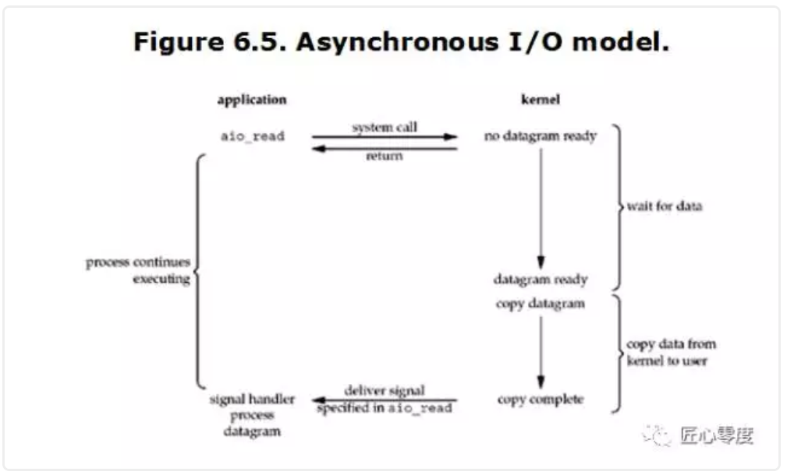
当用户进程向内核发起某个操作后，会立刻得到返回，并把所有的任务都交给内核去完成（包括将数据从内核拷贝到用户自己的缓冲区），内核完成之后，只需返回一个信号告诉用户进程已经完成就可以了。

**用户进程向OS发起read调用后直接返回，OS在数据就绪、拷贝到用户进程之后通知进程read完成**

### 小结
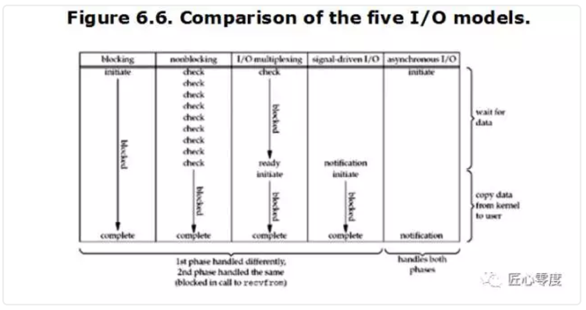
**结果表明：前四个模型之间的主要区别是第一阶段，四个模型的第二阶段是一样的：过程受阻在调用recvfrom当数据从内核拷贝到用户缓冲区。然而，异步I/O处理两个阶段，与前四个不同。**

**从同步、异步，以及阻塞、非阻塞两个维度来划分来看：**
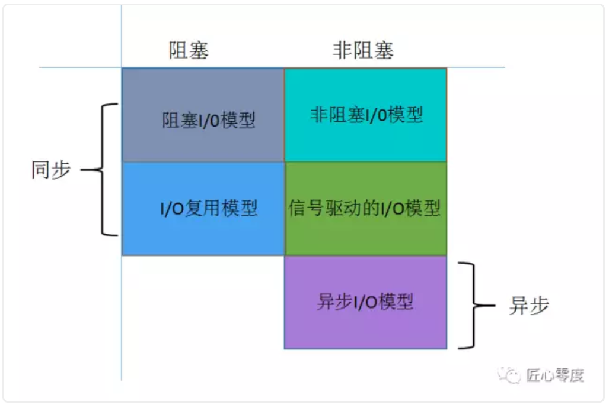


## Zero-Copy
### 概述
**Linux 中的零拷贝技术主要有下面这几种：**

- 直接 I/O：对于这种数据传输方式来说，应用程序可以直接访问硬件存储，操作系统内核只是辅助数据传输：这类零拷贝技术针对的是操作系统内核并不需要对数据进行直接处理的情况，数据可以在应用程序地址空间的缓冲区和磁盘之间直接进行传输，完全不需要 Linux 操作系统内核提供的页缓存的支持。
- 在数据传输的过程中，避免数据在操作系统内核地址空间的缓冲区和用户应用程序地址空间的缓冲区之间进行拷贝。有的时候，应用程序在数据进行传输的过程中不需要对数据进行访问，那么，将数据从 Linux 的页缓存拷贝到用户进程的缓冲区中就可以完全避免，传输的数据在页缓存中就可以得到处理。在某些特殊的情况下，这种零拷贝技术可以获得较好的性能。Linux 中提供类似的系统调用主要有 mmap()，sendfile() 以及 splice()。
- 对数据在 Linux 的页缓存和用户进程的缓冲区之间的传输过程进行优化。该零拷贝技术侧重于灵活地处理数据在用户进程的缓冲区和操作系统的页缓存之间的拷贝操作。这种方法延续了传统的通信方式，但是更加灵活。在Linux 中，该方法主要利用了写时复制技术。

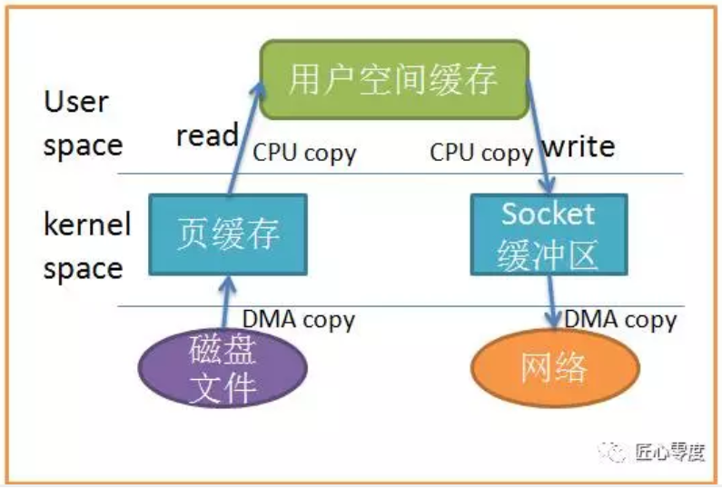
当应用程序访问某块数据时，操作系统首先会检查，是不是最近访问过此文件，文件内容是否缓存在内核缓冲区，如果是，操作系统则直接根据read系统调用提供的buf地址，将内核缓冲区的内容拷贝到buf所指定的用户空间缓冲区中去。如果不是，操作系统则首先将磁盘上的数据拷贝的内核缓冲区，这一步目前主要依靠DMA来传输，然后再把内核缓冲区上的内容拷贝到用户缓冲区中。 

接下来，write系统调用再把用户缓冲区的内容拷贝到网络堆栈相关的内核缓冲区中，最后socket再把内核缓冲区的内容发送到网卡上。

从上图中可以看出，共产生了四次数据拷贝，即使使用了DMA来处理了与硬件的通讯，CPU仍然需要处理两次数据拷贝，与此同时，在用户态与内核态也发生了多次上下文切换，无疑也加重了CPU负担。 在此过程中，我们没有对文件内容做任何修改，那么在内核空间和用户空间来回拷贝数据无疑就是一种浪费，而零拷贝主要就是为了解决这种低效性。

**我们减少拷贝次数的一种方法是调用mmap()来代替read调用：**
```
buf = mmap(diskfd, len);
write(sockfd, buf, len);
```

应用程序调用 mmap()，磁盘上的数据会通过 DMA被拷贝的内核缓冲区，接着操作系统会把这段内核缓冲区与应用程序共享，这样就不需要把内核缓冲区的内容往用户空间拷贝。应用程序再调用 write(),操作系统直接将内核缓冲区的内容拷贝到 socket缓冲区中，这一切都发生在内核态，最后， socket缓冲区再把数据发到网卡去。

使用mmap替代read很明显减少了一次拷贝，当拷贝数据量很大时，无疑提升了效率。但是使用 mmap是有代价的。当你使用 mmap时，你可能会遇到一些隐藏的陷阱。
例如，当你的程序 map了一个文件，但是当这个文件被另一个进程截断(truncate)时, write系统调用会因为访问非法地址而被 SIGBUS信号终止。 SIGBUS信号默认会杀死你的进程并产生一个 coredump,如果你的服务器这样被中止了，那会产生一笔损失。
通常我们使用以下解决方案避免这种问题：
- **为SIGBUS信号建立信号处理程序**
当遇到 SIGBUS信号时，信号处理程序简单地返回， write系统调用在被中断之前会返回已经写入的字节数，并且 errno会被设置成success,但是这是一种糟糕的处理办法，因为你并没有解决问题的实质核心。
- **使用文件租借锁**
通常我们使用这种方法，在文件描述符上使用租借锁，我们为文件向内核申请一个租借锁，当其它进程想要截断这个文件时，内核会向我们发送一个实时的 RT_SIGNAL_LEASE信号，告诉我们内核正在破坏你加持在文件上的读写锁。这样在程序访问非法内存并且被 SIGBUS杀死之前，你的 write系统调用会被中断。 write会返回已经写入的字节数，并且置 errno为success。 我们应该在 mmap文件之前加锁，并且在操作完文件后解锁：
```
if(fcntl(diskfd, F_SETSIG, RT_SIGNAL_LEASE) == -1) {
    perror("kernel lease set signal");
    return -1;
 }
 /* l_type can be F_RDLCK F_WRLCK  加锁*/
 /* l_type can be  F_UNLCK 解锁*/
if(fcntl(diskfd, F_SETLEASE, l_type)){
    perror("kernel lease set type");
    return -1;
}
```
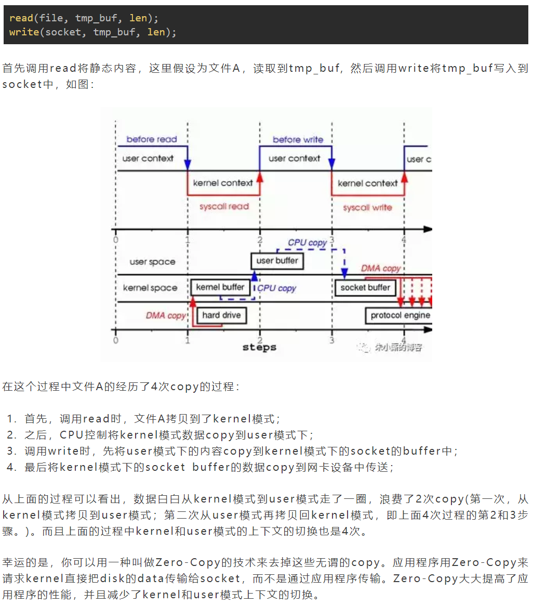

Zero-Copy技术省去了内核态到用户态再从用户态拷贝到内核态的过程，直接从read buffer拷贝到socket buffer，Java NIO中的FileChannel.transferTo()就是这样的实现。
```
public void transferTo(long position, long count, WritableByteChannel target);
```
底层调用的是系统的sendFile()方法
```
#include <sys/socket.h> 
ssize_t sendfile(int out_fd, int in_fd, off_t *offset, size_t count);  //一个系统调用
```
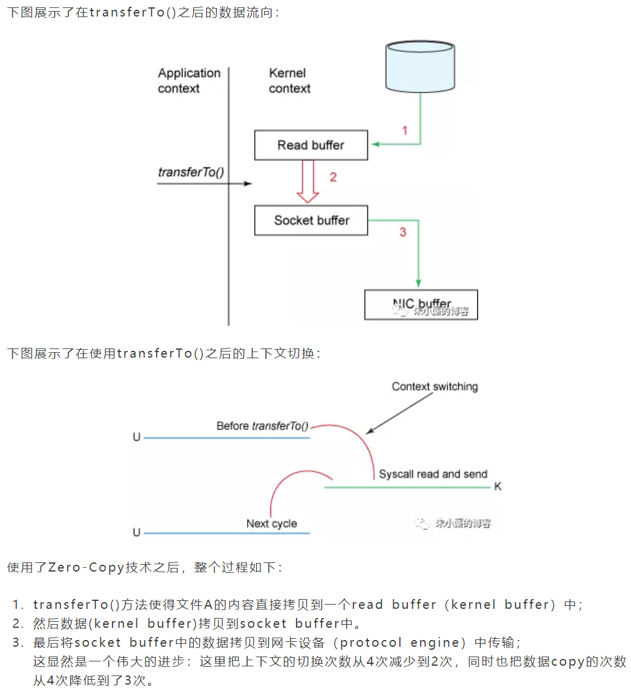

### 进阶
#### Linux 2.1
`sendfile(socket, file, len);`函数用于将文件通过socket传送。该函数通过一次系统调用完成了文件的传送，减少了原来read/write方式的模式切换。此外更是减少了数据的copy, sendfile的详细过程如图：
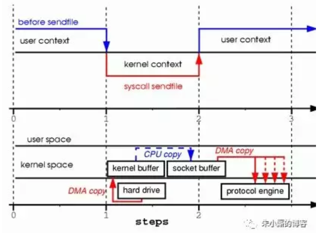

前两类方法的目的主要是为了避免应用程序地址空间和操作系统内核地址空间这两者之间的缓冲区拷贝操作。这两类零拷贝技术通常适用在某些特殊的情况下，**比如要传送的数据不需要经过操作系统内核的处理或者不需要经过应用程序的处理。**第三类方法则继承了传统的应用程序地址空间和操作系统内核地址空间之间数据传输的概念，进而针对数据传输本身进行优化。我们知道，硬件和软件之间的数据传输可以通过使用 DMA 来进行，DMA 进行数据传输的过程中几乎不需要CPU参与，这样就可以把 CPU 解放出来去做更多其他的事情，但是当数据需要在用户地址空间的缓冲区和 Linux 操作系统内核的页缓存之间进行传输的时候，并没有类似DMA 这种工具可以使用，CPU 需要全程参与到这种数据拷贝操作中，所以这第三类方法的目的是可以有效地改善数据在用户地址空间和操作系统内核地址空间之间传递的效率。

通过sendfile传送文件只需要一次系统调用，当调用sendfile时：
1. 首先（通过DMA）将数据从磁盘读取到kernel buffer中；
2. 然后将kernel buffer拷贝到socket buffer中；
3. 最后将socket buffer中的数据copy到网卡设备（protocol engine）中发送；

**sendfile与read/write模式相比，少了一次copy。但是从上述过程中也可以发现从kernel buffer中将数据copy到socket buffer是没有必要的。**

#### Linux 2.4
Linux2.4 内核对sendfile做了改进，如图：
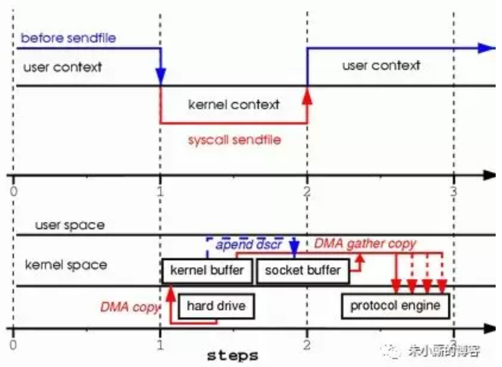

改进后的处理过程如下：
1. 将文件拷贝到kernel buffer中；
2. 向socket buffer中追加当前要发生的数据在kernel buffer中的位置和偏移量；
3. 根据socket buffer中的位置和偏移量直接将kernel buffer的数据copy到网卡设备（protocol engine）中；

经过上述过程，数据只经过了2次copy就从磁盘传送出去了。这个才是真正的Zero-Copy(这里的零拷贝是针对kernel来讲的，数据在kernel模式下是Zero-Copy)。

正是Linux2.4的内核做了改进，Java中的TransferTo()实现了Zero-Copy,如下图：
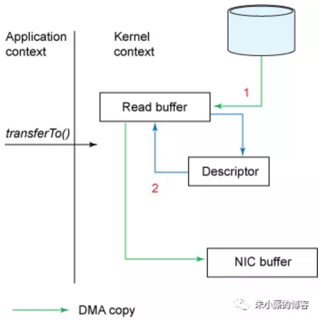
## Java NIO

### Channel
首先说一下Channel，国内大多翻译成“通道”。Channel和IO中的Stream(流)是差不多一个等级的。只不过Stream是单向的，譬如：InputStream, OutputStream.而Channel是双向的，既可以用来进行读操作，又可以用来进行写操作。
NIO中的Channel的主要实现有:
- FileChannel
- DatagramChannel
- SocketChannel
- ServerSocketChannel

### Buffer
NIO中的关键Buffer实现有：ByteBuffer, CharBuffer, DoubleBuffer, FloatBuffer, IntBuffer, LongBuffer, ShortBuffer，分别对应基本数据类型: byte, char, double, float, int, long, short。当然NIO中还有MappedByteBuffer, HeapByteBuffer, DirectByteBuffer等这里先不进行陈述。

### Selector

Selector运行单线程处理多个Channel，如果你的应用打开了多个通道，但每个连接的流量都很低，使用Selector就会很方便。例如在一个聊天服务器中。要使用Selector, 得向Selector注册Channel，然后调用它的select()方法。这个方法会一直阻塞到某个注册的通道有事件就绪。一旦这个方法返回，线程就可以处理这些事件，事件的例子有如新的连接进来、数据接收等。

