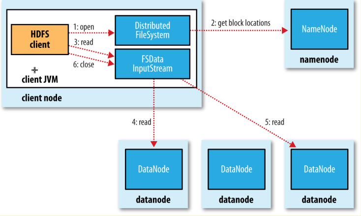
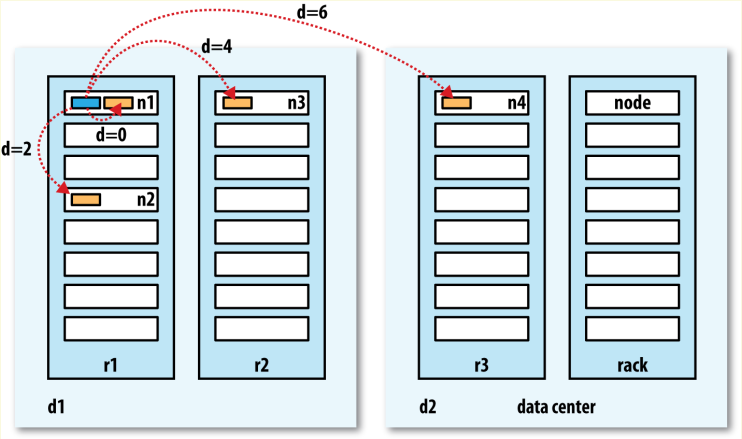
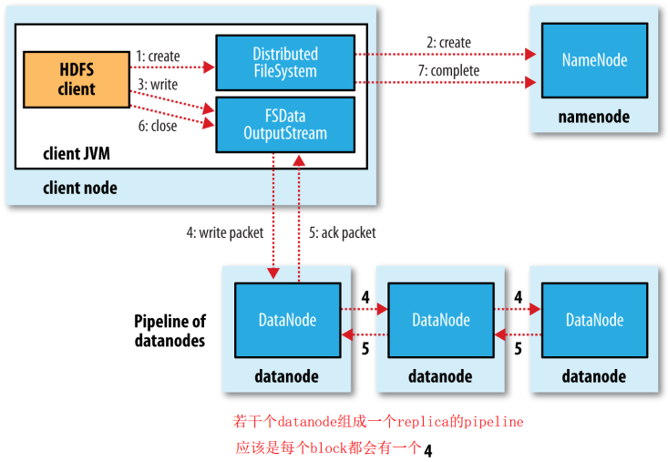

# CHAPTER 3 The Hadoop Distributed Filesystem

> **分布式文件系统**：Filesystems that manage the storage across a network of machines are called distributed filesystems.

## The Design of HDFS
HDFS设计用于存储大文件，并且以流的形式访问数据，运行在一组商用硬件上。
**特点：**

- Very large files：远超单个机器所能存储的文件大小
- Streaming data access：支持顺序访问，**面向一次写入，多次读取**，为吞吐量做了优化，牺牲了延迟
- Commodity hardware：运行在商用机器上，一部分节点失效后可以继续运行

**HDFS不适用的场景：**

- Low-latency data access：不能满足数十毫秒的访问延迟，HBase可能更合适
- Lots of small files：文件的元数据保存在namenode的内存中，文件数量受到内存限制
- Multiple writers, arbitrary file modifications：HDFS只支持追加写，不能随机修改，也不支持并发写

## HDFS Concepts

### Blocks
区块是读取和写入操作的最小单位，但与磁盘文件系统不同的是HDFS存储大小小于一个区块的文件时，并不会在磁盘上占用一整个区块。

**为什么HDFS中区块那么大？**  
优化磁盘寻道的开销，如在寻道时间10ms，读取速率100MB/s的磁盘上，要使寻道时间为读取时间的1%，则需要设置区块大小为100MB左右。区块太大也不好，会使文件的区块数量过少，MapReduce任务的并发数太少（MapReduce的task一次处理一整个区块）。

**使用*区块*抽象磁盘资源的好处**：

- **可以存储比单个磁盘大很多的文件**  
同一个文件的区块可以存储在不同的机器上。
- **简化了存储子系统**  
区块是固定大小的，方便管理。并且可以将权限管理分离到其他子系统中，存储子系统仅负责区块的管理。
- **提供了高容错和可用性**  
区块可以有若干replica，并且应用也可以通过增加replica的数量分散热点数据的读写负载。

### Namenodes and Datanodes
HDFS集群是Master-Slave模式，*namenode*管理集群的命名空间，维护*文件系统树*和*元数据*。这些数据会以*namespace image*和*edit log*的形式持久化到磁盘上。同时*namenode*还知道哪些*datanode*存储了这个文件的区块。（但是具体某个区块在哪个*datanode*上是不持久化的，而是每次启动时同*datanode*同步。）用户通过客户端访问文件，客户端提供了一套类似POSIX的API。

*datanode*负责存储区块，并周期性向*namenode*报告存储了哪些区块。

**Namenode挂掉整个集群都不可用，因此需要容错**：

- 将系统的状态持久化到磁盘
- 运行一个*secondary namenode*  
因为日志复制的时延，主挂掉之后会丢数据，将主持久化的状态拷贝到从再升级为主。

### Block Caching
可以显式地将区块缓存在堆外内存中，提升读取性能。

### HDFS Federation
单个namenode的内存会成为瓶颈，自2.x之后引入了多namenode，每个namenode维护一部分系统的命名空间（namespace volume）。并且将区块分到不用的区块池中，分给不同的namenode维护。  

每个namenode绑定一个路径，独自维护这个路径下的文件，因此namenode之间不互相通信，失效也不会影响其他namenode，**namenode和datanode之间是多对多的关系**。


## Data Flow

### 读取文件


1. 调用`FileSystem`对象的`open()`方法大小想要读取的文件  
2. `FileSystem`对象通过RPC向*namenode*获取头几个区块的地址，这些地址根据距离排序  
2. 客户端调用`read()`时，`FSDataInputStream`对象从当前区块的*datanode*读取数据，区块读完时连接下一个区块的*datanode*。
3. 客户端调用`close()`

> 如果一个*datanode*挂掉了，则从其他*datanode*读取，并记录下这个挂掉的节点，后续不会再访问；若返回的区块坏掉了，则从其他*datanode*读取并告知*namenode*。

**客户端与节点直接通信的好处：**

- 将连接分散，可以同时支持更多的客户端访问
- *namenode*只需要负责区块位置的查询

> ### 网络拓扑
> 
> **Hadoop将节点间的距离分为四种：**
> 
> - 同一个节点
> - 同一个机架
> - 同一个数据中心
> - 不同数据中心
> 
> 这四种距离的传输开销依次变大，默认情况下Hadoop假设网络拓扑是**扁平的**。

### 写入文件


1. 客户端调用`FileSystem`的`create()`方法创建文件
2. `FileSystem`通过RPC向*namenode*发起请求，*namenode*检查客户端的权限以及文件是否存在，满足条件则创建新文件的记录。
3. 客户端调用`FSDataOutputStream`的`write()`方法写入数据。`FSDataOutputStream`会将数据划分为一个个数据包放入*data queue*，由`DataStreamer`向*namenode*申请新的区块，将若干个合适的`datanode`串联到一起形成*pipeline*，客户端只需要将数据写入*pipeline*中的第一个*datanode*即可，*datanode*会将数据逐级传递到下游的节点。`FSDataOutputStream`也会维护一个数据包的ACK队列，如果有数据包写入失败，则从*pipeline*中剔除挂掉的节点，重新向*namenode*申请ID，并将数据包放入*data queue*重新传输。
4. 客户端调用`close()`方法

**replica的存放位置需要考虑可靠性和读写带宽：**

- 第一个replica放在与客户端相同的节点（外部的客户端则随机选择一个节点）
- 第二个replica选择与第一个不同的机架
- 第三个replica选择与第二个相同机架的不同节点
- 其他的replica则随机选择

### Coherency Model
> A coherency model for a filesystem describes the data visibility of reads and writes for
a file.

```ruby
Path p = new Path("p");
OutputStream out = fs.create(p);
out.write("content".getBytes("UTF-8"));
out.flush();
assertThat(fs.getFileStatus(p).getLen(), is(0L));
```

读提交，正在写入的区块对其他客户端是不可见的。

```ruby
Path p = new Path("p");
FSDataOutputStream out = fs.create(p);
out.write("content".getBytes("UTF-8"));
out.hflush();
assertThat(fs.getFileStatus(p).getLen(), is(((long) "content".length())));
```

`close()`方法默认执行，保证在调用之前的写入都是可见的，但只保证数据到达了*datanode*的内存，不保证已经写入磁盘。**如果整个数据中心掉电还是有可能丢失数据。**

```ruby
FileOutputStream out = new FileOutputStream(localFile);
out.write("content".getBytes("UTF-8"));
out.flush(); // flush to operating system
out.getFD().sync(); // sync to disk
assertThat(localFile.length(), is(((long) "content".length())));
```

保证调用之前写入可见，并保证数据都已写入磁盘。

> 需要根据事件需要选择合适的方法，这三种方法的开销一次增加，一致性和可靠性也依次增加。

