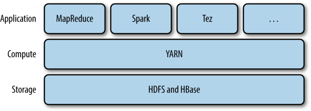
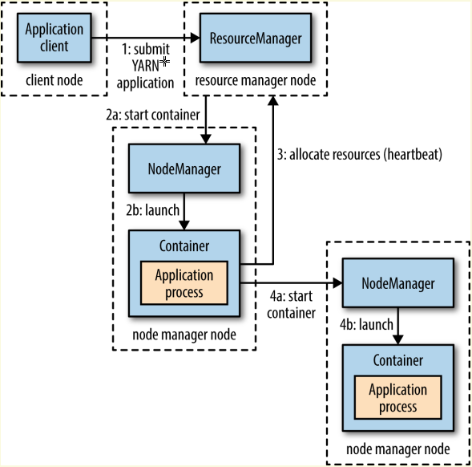
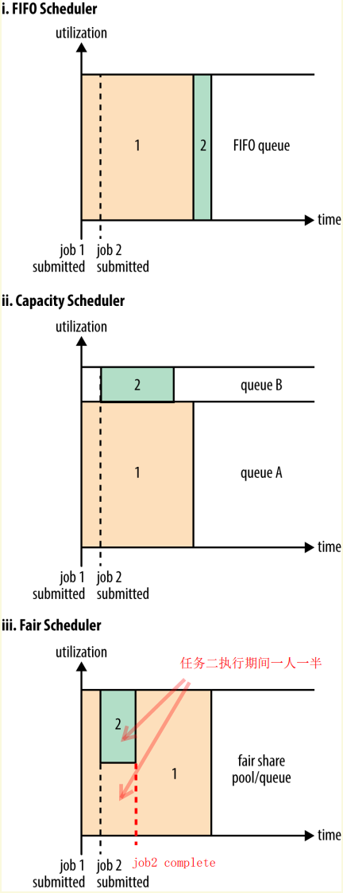
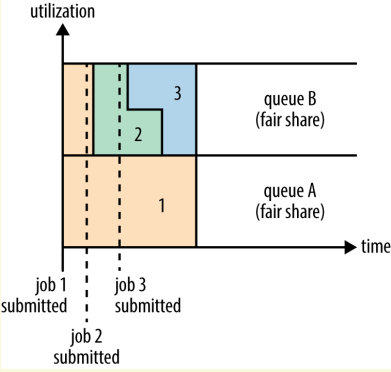

# CHAPTER 4 YARN
YARN (Yet Another Resource Negotiator)是Hadoop集群的资源管理系统。自Hadoop 2引入，为了优化MapReduce的性能，也可以为其他分布式计算提供管理。

为用户屏蔽了资源管理的细节，用户代码以*YARN app*的形式跑在集群的compute层之上。



## Anatomy of a YARN Application Run

YARN集群中主要分为：

- **resource manager**：管理整个集群的资源
- **node managers**：每个节点起一个，负责监管container
- **container**：负责运行用户代码，一个*container*是一个Unix进程或一个Linux cgroup



1. 客户端向*resource manager*请求运行application master process（1）
2. *resource manager*分配一个*node manager*在新的container中运行application master process（2a、2b）
3. application master process可以单纯地在这个container中运行，也可以向*resource manager*申请更多的资源（3）
4. *resource manager*分配完所需资源后就可以进行分布式计算了（4a、4b），**分布式计算的具体细节见“Anatomy of a MapReduce Job Run”**

> YARN本身没有提供应用三个组件（client，master，process）之间的通信机制，可能需要自己使用额外的通信机制

### 资源请求
请求包含了container所需的资源（内存、CPU）以及每个container的本地化约束条件。

YARN允许应用指定本地化约束条件，申请集群中任意节点上的container。当本地化约束条件无法被满足时，约束条件可以放宽，如某个节点放宽到同一个机架，某个机架放宽到同一个数据中心。在进行MapReduce计算时会优先分配在存有数据区块的节点上。

YARN的应用在运行时也可以随时申请资源，应用可以在一开始就申请全部资源（如Spark），也可以在运行时动态申请资源（如MapReduce，在map阶段是一次性申请分配所有mapper的资源，当某个task挂掉时会动态分配一个container重新运行失败的任务）。

### 应用寿命
应用寿命主要分为三类：

- 单任务单应用  
如一个MapReduce任务
- 多任务单应用  
Spark使用了这种模型，可以复用container，缓存中间结果。
- 长时间运行的共享应用  
主要作为一种服务

### YARN与MapReduce 1对比
MapReduce 1的集群主要是两种守护进程：

- **jobtracker**：负责任务的调度、工作进程的监控、历史记录。等于YARN中的Resource manager、application master，timeline
- **若干tasktrackers**：同nodemanager

**二者的对比**：

- 伸缩性  
MapReduce 1只能支持4000节点和40000任务，YARN可以支持10000节点和100000任务。
- 可用性  
MapReduce 1中jobtracker负责的功能太多，不容易实现高可用，将jobtracker分为recource manager和application master之后只需要分别实现可用性即可。
- 资源利用率  
MapReduce 1中将tasktracker的资源划分为固定大小的slot，并且map slot和reduce slot不通用，会造成资源的闲置。而YARN中则是由node manager管理一个资源池，资源的分配粒度更小，当资源足够时就可以分配。
- 多租户  
YARN可以支持MapReduce之外的应用，也支持不同版本的MapReduce应用运行在用一个YARN集群中。

## 调度
YARN中有三种调度器：

- FIFO  
优点是实现简单，但不支持共享集群，大任务可能会导致小任务饥饿
- Capacity  
小任务有专门的队列，并且会为小任务预留一部分资源
- Fair Schedulers  
不需要预留资源，会动态平衡任务之间的资源。在平衡资源时不采用强占的方式，需要等待container结束，因此具有一定的延迟




### Capacity Scheduler
可以保证多个租户的可用资源数量，在单个队列中依旧使用FIFO策略调度任务。在集群空闲时，一个队列的任务可能会得到超过这个队列额定数量的资源，这叫做：*queue elasticity*。多分配的资源不会被剥夺，会在container结束后回收。

```xml
<?xml version="1.0"?>
<configuration>
    <property>
        <name>yarn.scheduler.capacity.root.queues</name>
        <value>prod,dev</value>
    </property>
    <property>
        <name>yarn.scheduler.capacity.root.dev.queues</name>
        <value>eng,science</value>
    </property>
    <property>
        <name>yarn.scheduler.capacity.root.prod.capacity</name>
        <value>40</value>
    </property>
    <property>
        <name>yarn.scheduler.capacity.root.dev.capacity</name>
        <value>60</value>
    </property>
    <property>
        <name>yarn.scheduler.capacity.root.dev.maximum-capacity</name>
        <value>75</value>
    </property>
    <property>
        <name>yarn.scheduler.capacity.root.dev.eng.capacity</name>
        <value>50</value>
    </property>
    <property>
        <name>yarn.scheduler.capacity.root.dev.science.capacity</name>
        <value>50</value>
    </property>
</configuration>
```

任务队列的配置的命名规则为：`yarn.scheduler.capacity.<queue-path>.<sub-property>`

- `<queue-path>`是队列的点分层级路径
- `<sub-property>`是属性名

配置中的`capacity`为计算资源的百分比，加起来应该是100%。

在提交任务时可以指定目标队列名称，若指定了一个不存在的队列则返回错误，若没有指定队列，则默认放到`default`队列中。指定队列时仅需指定点分路径最后部分的名称即可，全称无法使用。

### Fair Scheduler
Fair Scheduler会尽力让同一个队列中的任务平分计算资源。



在*yarn-site.xml*中设置`yarn.resourcemanager.scheduler.class`为`org.apache.hadoop.yarn.server.resourcemanag
er.scheduler.fair.FairScheduler`即可启用Fair Scheduler。如果没有指定配置文件则所有任务会被放到同一个队列中。

```xml
<?xml version="1.0"?>
<allocations>
    <defaultQueueSchedulingPolicy>fair</defaultQueueSchedulingPolicy>
    <queue name="prod">
        <weight>40</weight>
        <schedulingPolicy>fifo</schedulingPolicy>
    </queue>
    <queue name="dev">
        <weight>60</weight>
        <queue name="eng" />
        <queue name="science" /></queue>
    <queuePlacementPolicy>
        <rule name="specified" create="false" />
        <rule name="primaryGroup" create="false" />
        <rule name="default" queue="dev.eng" />
    </queuePlacementPolicy>
</allocations>
```

配置中的`weight`是权重，全部求和之后再计算比例。对于没有在配置中声明的队列权重默认是1。

Fair Scheduler的队列可以设置不同的调度策略，默认是fair scheduling，也可以设置为FIFO和 Dominant Resource Fairness (drf)。

Fair Scheduler使用规则决定任务放到哪个队列，规则从上到下匹配，直到有一个匹配中。上述配置，如果用户指定了队列则先放到指定队列，若没有指定或队列不存在则放到用户的Unix group中，默认的策略是丢到`dev.eng`中。

