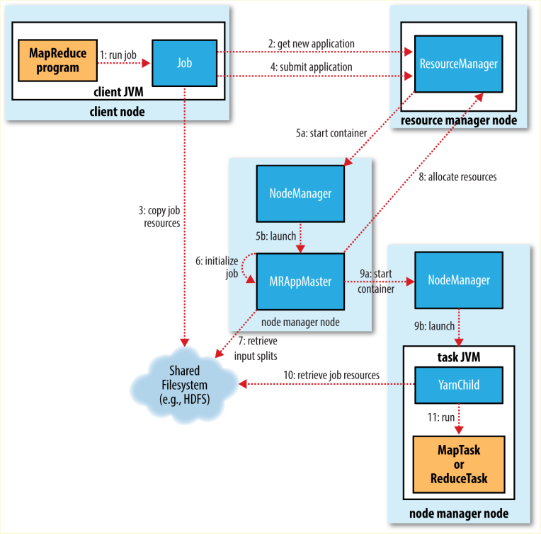
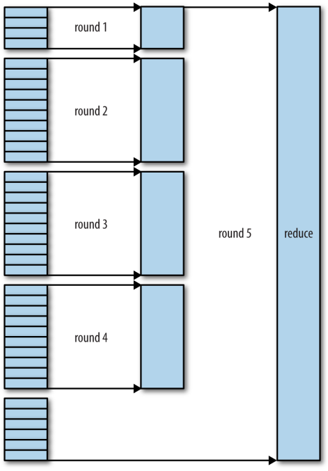

# CHAPTER 7 How MapReduce Works

## Anatomy of a MapReduce Job Run
可以通过调用`Job`对象的`submit()`方法或者`waitForCompletion()`方法启动一个任务。任务的启动过程大概涉及到五个实体：（不包括*history server*和*shuffle handler auxiliary service*）

- client：提交MapReduce作业
- YARN resource manager：协调集群计算资源的分配
- YARN node manager：启动和监控*container*
- application master：协调*tasks*，*application master*和*tasks*都运行在*container*中
- distributed filesystem：用来在上面的实体之间共享所需的文件

### Job Submission
`submit()`方法会在内部创建一个`JobSubmitter`实例，并调用其`submitJobInternal()`方法。提交任务后`waitCompletion()`方法每秒查询一次任务的进度，并在进度有进展时输出到控制台，任务成功完成后会输出计数器信息，失败时会输出错误信息。

`JobSubmitter`逻辑如下：

1. 向*resource manager*询问一个新的*application ID*，将其用作*MapReduce job ID*（step 2）
2. 检查任务的输出配置。如未指定输出目录、输出目录已存在，则不会提交任务而是抛出错误。
3. 计算输入的划分，如果无法成功计算，则不会提交任务而是抛出错误。
4. 拷贝运行任务所需的资源，如任务的JAR，配置文件，输入划分的计算结果等。这些文件会存入以*job ID*命名的文件夹中（step 3）。任务JAR的replica因子比较高，默认是10（`mapreduce.client.submit.file.replication`），这样集群中会有许多副本共*node manager*访问。
5. 调用*resource manager*的`submitApplication()`提交任务（step 4）。

### Job Initialization
*resource manager*收到`submitApplication()`调用之后会将请求交由YARN的调度器处理，调度器分配一个container并由*resource manager*在其中启动*application master*（step 5a、5
b）。

初始化任务时会首先创建若干簿记对象追踪任务的进度，接收tasks的进度报告（step 6）。然后会读取输入的划分结果，为每一个分区创建一个map task对象，也会根据配置（`mapreduce.job.reduces`，`Job.setNumReduceTasks()`）创建对应数量的reduce task对象，并为task分配ID。

如果一个任务满足小任务（uber task）的条件，则会直接在*application master*的JVM中串行执行。因为分配额外的container并行执行任务的开销大过了并行执行带来的收益。

**小任务条件**：

- `mapreduce.job.ubertask.maxmaps`，任务的mapper数量少于这个，默认10
- `mapreduce.job.ubertask.maxreduces`，任务的reducer数量少于这个，默认1
- `mapreduce.job.ubertask.maxbytes`，任务所需的数据量少于这个，默认一个HDFS区块大小

在任务执行前*application master*会调用`OutputCommitter`的`setupJob()`方法，如`FileOutputCommitter`会创建最终的输出目录和任务运行所需的临时目录。

### Task Assignment
如果提交的不是uber task，*application master*会向*resource manager*申请map和reduce所需的*container*，会优先请求map的资源，reduce的资源会稍后在请求，在reduce阶段开始之前所有map任务必须结束，当5%的map task完成之后才会开始分配reduce的资源。请求会指定每个task所需的内存和CPU资源，默认会分配1GB内存和1个虚拟核心。可以通过`mapreduce.map.memory.mb`,  `mapreduce.reduce.memory.mb`,  `mapreduce.map.cpu.vcores` 和 `mapreduce.reduce.cpu.vcores`配置。

Reduce task可以运行在任意节点上，但map task则由数据本地化的限制，task的节点分布可以从job counter中得到。

### Task Execution
*resource manager*的调度器为task分配好*container*之后，*application master*会与对应的*node manager*建立连接并启动task（step 9a、9b）。task会执行`YarnChild`类的`main()`方法，在真正启动前它会将task所需的资源下载到本地，如配置、JAR和分布式缓存中的文件（step 10），最后才会执行map或reduce task。

`YarnChild`运行在单独的JVM中，任何用户定义的map和reduce函数的bug都不会影响到*node manager*。

task会根据job的`OutputCommitter`执行对应的setup和commit操作。对于基于文件的job，commit操作会将task的输出从临时目录移动到最终的目录。这种commit协议能够保证在同时执行多个相同的task时（Speculative Execution），有且仅有一个task能够commit，其他task会被中止。

### Progress and Status Updates
MapReduce的任务执行时间都很长，因此需要给用户适当地反馈执行期间的状态。task会时刻跟踪自己的进度，如map task的进度表示为**输入已经处理的比例**，而reduce task则是根据shuffle分为三个阶段：copy（1/3），sort（1/3），reduce（1/3）。

Hadoop不会杀掉一个有进度的task，以下操作都会产生进度：

- 读数据
- 写数据
- 设置状态描述，`TaskAttemptContext`的`setStatus()`方法
- 改变计数器的值，`Reporter`的`incrCounter()`方法和`Counter`的`increment()`方法
- 调用`Reporter`或`TaskAttemptContext`的`progress()`方法

task进程会通过*umbilical*接口向*application master*报告进度和状态，*application master*将数据汇总成整个job的进度和状态，并以三秒的间隔刷新。

客户端会每秒（`mapreduce.client.progressmonitor.pollinterval`）向*application master*拉取最新的状态数据。可以通过`Job`的`getStats()`方法获取一个`JobStatus`实例，其包含任务的所有状态数据。

### Job Completion
当*application master*收到最后一个task完成的通知时，会将job的状态置为**successful**，当客户端拉取状态数据时会得知任务已完成，打印一条消息告诉用户，从`waitForCompletion()`方法中返回，最后打印job的统计和计数器数据。若设置了`mapreduce.job.end-notification.url`则会通过HTTP向指定URL发送任务完成通知。

最后，*application master*和*task container*会清理运行状态，删除中间结果，并调用`OutputCommitter`的`commitJob()`方法，job的信息会归档到*job history server*以供未来的查询。

## Failures
考虑四个实体的失效：

- task
- application master
- node manager
- resource manager

### TaskFailure
#### UDF出错
当UDF（User Defined Function）抛出运行时异常时，task JVM会在退出前向*application master*报告错误。错误最终会输出到*user log*中。*application master*会将这次task的尝试标记为失败，释放*container*。对于流式task则会直接将task标记为**failed**（`stream.non.zero.exit.is.failure`）

#### JVM崩溃
当task JVM直接崩溃时，*node manager*会察觉到有一个*container*挂掉了，此时直接告知*application master*。

#### task卡住
对于task卡住，*application master*会知道task一段时间内没有产生进度，直接将task标记为**failed**，在此之后对应的JVM进程会被杀掉。判断任务挂掉的时间默认是10分钟（`mapreduce.task.timeout`）。对于流式task卡住，则是由*node manager*杀掉（包括启动该task的JVM进程）。

> If a Streaming process hangs, the node manager will kill it (along with the JVM that launched it) only in the following circumstances: either `yarn.nodemanager.container-executor.class` is set to `org.apache.hadoop.yarn.server.nodemanager.LinuxContainerExecutor`, or the default container executor is being used and the setsid command is available on the system (so that the task JVM and any processes it launches are in the same process group). In any other case, orphaned Streaming processes will accumulate on the system, which will impact utilization over time.

*application master*在task失败之后会重新调度该task，并避免在之前失败过的节点上再次执行。当一个task失败4次（`mapreduce.map.maxattempts`，`mapreduce.reduce.maxattempts`）之后。整个job会失败。也可以指定一小部分task彻底失败后不触发整个job的失败，`mapreduce.map.failures.maxpercent`和 `mapreduce.reduce.failures.maxpercent`。

一个task attempt可能会被主动杀掉，如speculative duplicate；*node manager*挂掉，*application master*会将在这个节点上执行的所有task视作被杀掉。被主动杀掉的task不会计算在task失败的次数中，因为这不是task的错。

### Application Master Failure
*application master*挂掉后YARN会重试，重试次数由`mapreduce.am.max-attempts property`指定，默认是2。
YARN也限制了任何app在集群中最大的重试次数，由`yarn.resourcemanager.am.max-attempts`指定，默认是2。

*application master*会周期性向*resource manager*发送心跳数据，当*application master*失败后，*resource manager*会重新启动一个*application master*。对于MapReduce应用来说，会使用*job history*恢复已经完成的task进度，已经完成的task就不需要重新运行了。`yarn.app.mapreduce.am.job.recovery.enable`可以控制是否恢复，默认为`true`。

客户端会周期性从*application master*拉取状态数据，当*application master*失败并被*resource manager*重启之后，客户端拉取状态数据时会超时，此时客户端会重新向*resource manager*询问*application master*的地址。

### Node Manager Failure
如果*resource manager*超过10分钟（`yarn.resourcemanager.nm.liveness-monitor.expiry-interval-ms`）没收到*node manager*的心跳包，则认为这个节点挂掉了，会将其从节点池中移除。所有在这个节点中运行的task都会按上述方法恢复。并且*application master*会重新运行失败节点上已经完成的task，因为很可能完成的结果数据无法访问了。

*application master*会将频繁有task挂掉的节点列入黑名单，并尝试将task调度到其他节点。默认一个*node manager*上挂掉3个task就会列入黑名单，数量由`mapreduce.job.maxtaskfailures.per.tracker`配置。job之间的黑名单是独立的，因此新job的task可能会调度到被其他job列入黑名单的节点上。

### Resource Manager Failure
一旦*resource manager*挂掉job和*task container*都无法启动，后果很严重。默认配置下，*resource manager*会遭受单点故障，所有正在运行的job都会挂掉，而且无法恢复。

为了实现高可用（HA），应该部署两台互为热备份的*resource manager*。所有正在运行的job的信息会存储在高可用的状态存储中（如ZooKeeper、HDFS），热备的*resource manager*可以从这里恢复核心的状态。*node manager*的信息不会存储到状态存储中，因为这些信息可以在第一个心跳中重新构建出来。tasks的信息也不包含在状态存储中，这些信息是由*application master*管理的，所以需要持久化的状态比MapReduce 1中的*jobtracker*要少很多。

新的*resource manager*接管时，会从状态存储中读取应用的信息，重新启动所有应用的*application master*，这个不会算进应用的尝试次数中。应用只会恢复已经完成的task。

*resource manager*从热备状态转变为活跃状态是由*failover controller*控制的，默认只有一个*failover controller*，使用ZooKeeper的leader election确保同一时间内只有一个活跃的。*failover controller*可以是单独的进程，也可以内置到*resource manager*。

客户端和*node manager*必须正确配置才能支持*resource manager*挂掉恢复。它们会以**round-robin**的方式轮流尝试和两个*resource manager*通信，直到成功与活跃的建立连接。

## Shuffle & Sort
MapReduce保证输入到reducer中的数据都是按key排好序的。**将map的结果按key排序，并转换为reduce的输入的过程就是*shuffle*。**

> MIT 6.824中，*shuffle*也可以认为是将行存储转变为列存储的过程。

### The Map Side
map函数输出的结果并不是直接写入磁盘的，而是先在缓冲区中预排序。

每个map task都会将输出写入到一个环形缓冲区（memory buffer），默认100MB大小（`mapreduce.task.io.sort.mbproperty`）。当缓冲区满到一定程度（`mapreduce.map.sort.spill.percent`，默认为0.80，即80%），后台线程开始将数据写入磁盘，map的输出不会受影响。若缓冲区满了，map会阻塞直到写磁盘完成。输出数据会以**round-robin**的形式写入到`mapreduce.cluster.local.dir property`指定的目录中。

记录在写入磁盘前会根据下游消费的reducer划分到不同的partition中。每一个partition都会有一个后台的线程在内存中将记录按照key排序，如果指定了combiner函数则会对排序的结果调用。combiner函数可以精简map的输出，减少需要传输到reducer的数据。

环形缓冲区（memory buffer）每次到达阈值需要写入磁盘时，都会创建一个新的spill文件。所有一个map会有多个spill文件，在task结束之前，会将这些spill文件按照分区合并到一个输出文件中。`mapreduce.task.io.sort.factor`控制同时合并多少个spill文件，默认10。

如果至少有3个spill文件（`mapreduce.map.combine.minspills`），combiner函数会在最终写入输出文件前被再次执行。如果只有一两个spill文件，就不会再次执行combiner函数了。

在写入输出文件时可以启用压缩，增加写入速度，节约磁盘空间，减少传输给reducer的数据大小。默认是不启用压缩的（`mapreduce.map.output.compress`），压缩算法由`mapreduce.map.output.compress.codec`指定。

输出文件的partition通过HTTP向reducer提供，最多的worker线程数量由`mapreduce.shuffle.max.threads`设置，这个设置是控制每个*node manager*的（意思是partition数据的读取是由*node manager*负责的，map task结束后就释放资源了），不是控制每个task的。默认是0，表示两倍于机器的CPU核心数。

> map的结果会在job完成时由*application master*控制删除。

### The Reduce Side

**copy phase**
Mapper在完成后会利用心跳机制通知*application master，reducer会周期性向*application master*询问已经完成的map结果，拿到结果的位置之后会直接从mapper上下载。下载是多线程的，线程数量由`mapreduce.reduce.shuffle.parallelcopies`控制，默认数量是5。

当map的结果小于一个阈值（`mapreduce.reduce.shuffle.input.buffer.percent`，占用堆内存的比例）时，会直接保存在内存中。

当内存缓存超过一个阈值（`mapreduce.reduce.shuffle.merge.percent`）或者下载了一定数量的map结果（`mapreduce.reduce.merge.inmem.threshold`），会将他们合并然后写入到磁盘。如果定义了*combiner*则会在merge时调用，降低需要写入磁盘的数据量。

一个后台线程会将写入了磁盘的数据进行merge成一个更大的，有序的文件。这样可以减少后面merge所需的时间。

**sort phase**
当所有的map结果都下载完成后，会进入**sort phase**。这个阶段的主要工作是merge，会根据*merge factor*进行多轮merge，如：有50个map的输出，而*merge factor*为10，则需要进行5轮merge，每轮将10个map输出merge为一个文件，最后会产出5个中间文件。

这5个中间文件并不会被merge为一个最终的文件，而是通过内存中和磁盘的混合直接merge为reduce的输入。

> 上述说的太简单，具体的过程是：假如有40个map输出，则在第一轮会先merge 4个，后续的3轮会merge 10个，最后一轮将全部的结果进行merge。这样做没有改变merge的轮数，只是优化了需要写入磁盘的数据量，因为最后一轮merge的结果是直接输入给reduce的。
> 

**reduce phase**
在此阶段，会对每一个key调用一次reduce函数，输出会被直接写入到输出指定的文件系统，如HDFS。并且这个reducer所在的*node manager*上也同样运行着*datanode*，所以输出的第一个区块的副本会写入到本地磁盘。

### Configuration Tuning

## Task Execution

