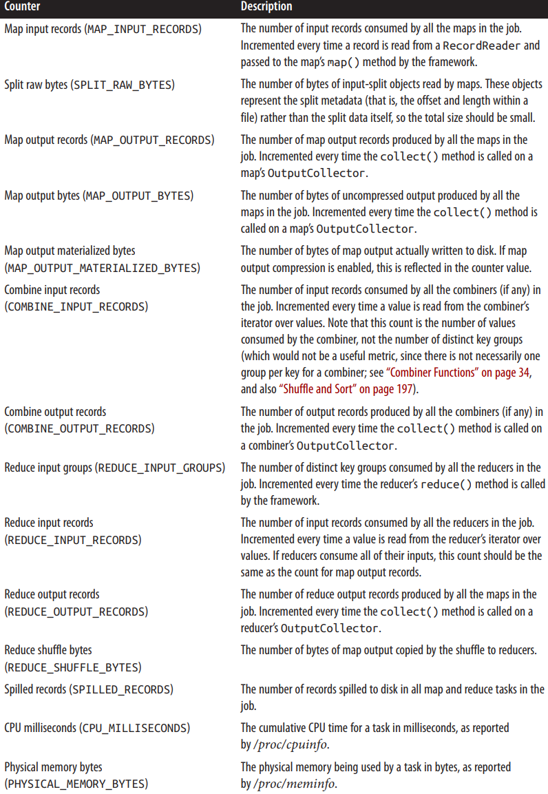
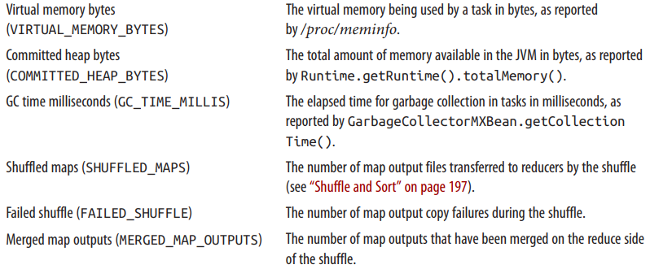
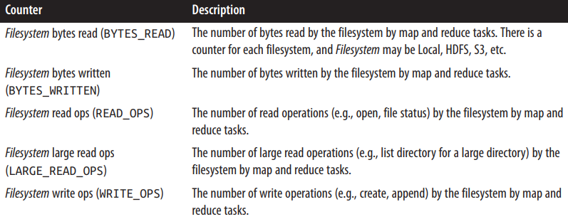
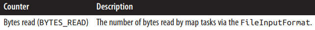
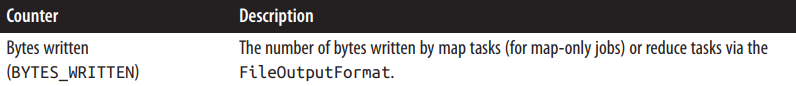
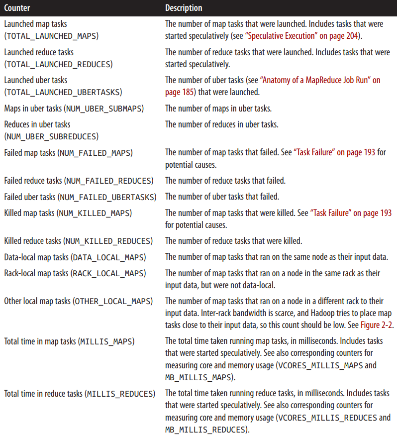

# CHAPTER 9 MapReduce Features
## Counters

Counters可以更好更方便的记录任务过程中某些事件的发生次数。

### Built-in Counters
Hadoop内置了一些Counter，可以记录字节数或者记录数。

| Group                     | Name/Enum                                                      | Reference |
| :------------------------ | :------------------------------------------------------------- | :-------- |
| MapReduce task counters   | org.apache.hadoop.mapreduce.TaskCounter                        |           |
| Filesystem counters       | org.apache.hadoop.mapreduce.FileSystemCounter                  |           |
| FileInputFormat counters  | org.apache.hadoop.mapreduce.lib.input.FileInputFormatCounter   |           |
| FileOutputFormat counters | org.apache.hadoop.mapreduce.lib.output.FileOutputFormatCounter |           |
| Job counters              | org.apache.hadoop.mapreduce.JobCounter                         |           |

#### Task counters
Task counters负责收集task执行过程中的信息，由每一个task attempt独自维护，并周期性发送给*application master*，由其将结果聚合为整个job的结果。每次发送都是发送全量，而不是自上次上传的增量。这样可以防止消息丢失导致的计数不准，并且当有task挂掉时，counter的计数也会下降。

**内置的MapReduce task counters**



**内置的文件系统task counters**


**内置的 FileInputFormat task counters**


**内置的 FileOutputFormat task counters**


#### Job counters
Job counters由*application master*维护，不需要在网络中传输。其中包含了用户定义的counter，记录的是job级别的统计数据，并不记录task运行过程中的数据。



#### User-Defined Java Counters
Counters是通过Java的枚举类型定义的，可以同时定义一组相关的counters。枚举类型的名字作为counters的group名，枚举的字段名作为counter的名字。MapReduce框架就将这些counters的计数汇总到一起。

```java
context.getCounter(Temperature.MALFORMED).increment(1);
```

##### Dynamic counters
要动态的获取未事先定义的counter，可以通过`Context`对象的以下方法：
```java
public Counter getCounter(String groupName, String counterName)
```
这个方法同样可以以枚举类型指定`groupName`，因为Hadoop在发送RPC请求时会将枚举类型转换为字符串。

##### Retrieving counters
首先通过job ID获取到job的实例（`cluster.getJob(JobID.forName(jobID))`），然后通过`job.getCounters()`方法获取到该job所有的counters。最后根据counter的名字（`counters.findCounter()`）获取到对应的计数。

#### User-Defined Streaming Counters
对于流式的MapReduce任务，可以通过向标准错误流输出特定格式的行实现计数的更新。
```regex
reporter:counter:group,counter,amount
```
同样也可以通过这种方法输出状态信息：
```regex
reporter:status:message
```

## Sorting
